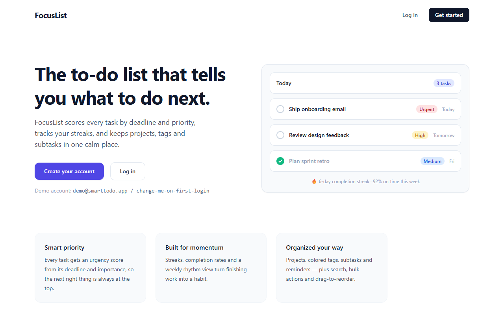
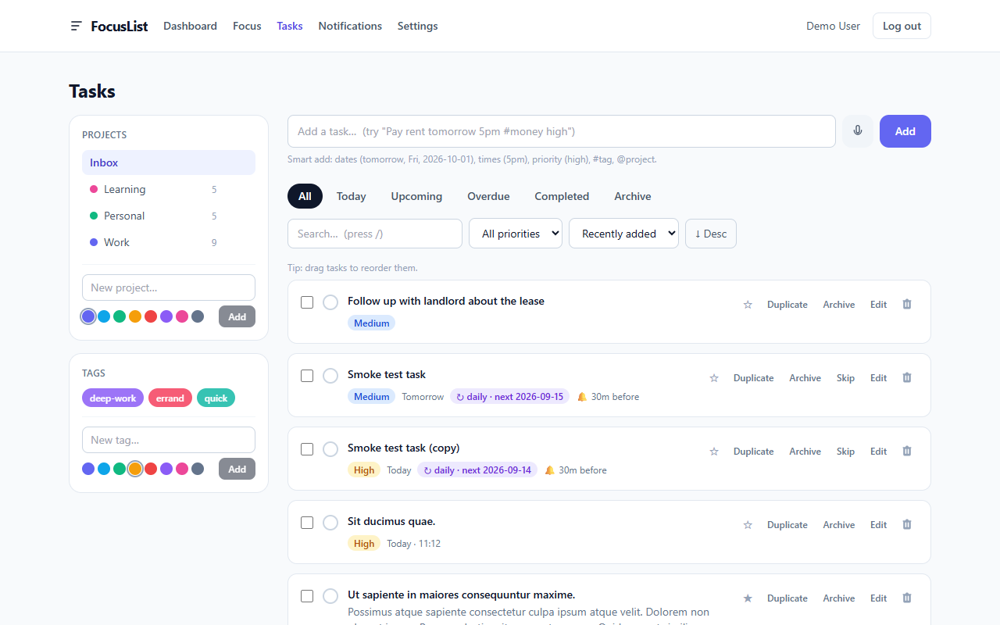
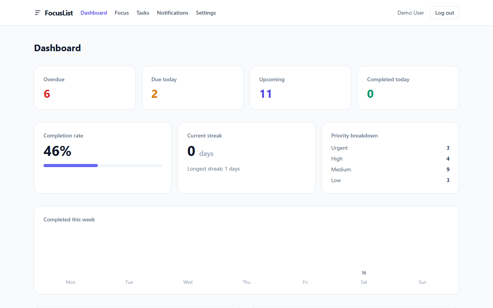
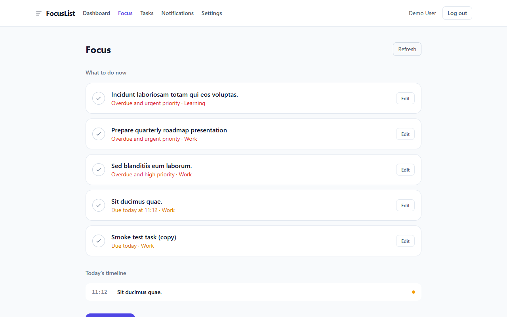
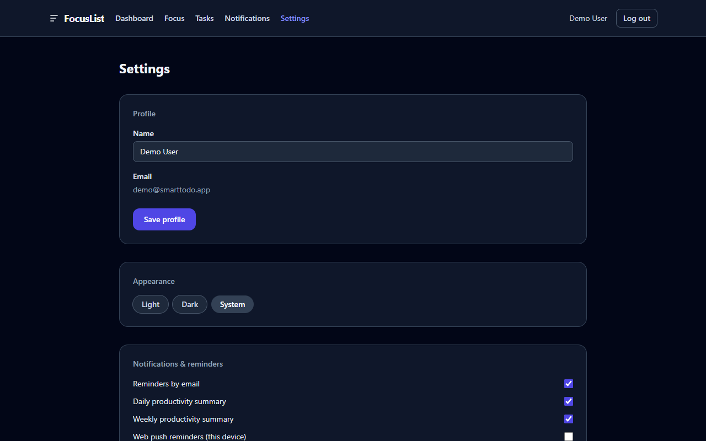
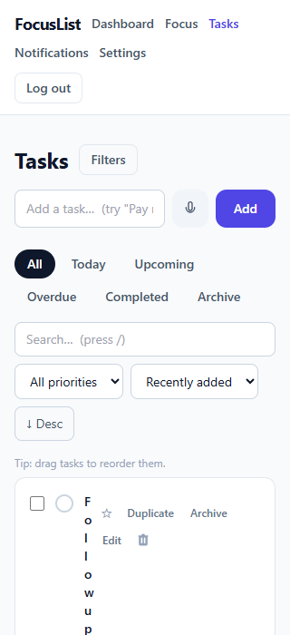

<div align="center">

# FocusList

**A smart to-do app that tells you what to do next.**

Laravel 12 + React 18 · priorities, due dates, streaks, recurrence, reminders, and a calm focus view — production-ready and fully responsive.


</div>

---

## What is FocusList?

Most to-do lists are passive: you file tasks and hope you remember them. FocusList is active — every task is scored by deadline and priority so the **next right thing is always at the top**.

- **Smart priorities** — deterministic urgency scoring (`Task::urgencyScore()`)
- **Focus view** — a short "do this next" list, today's timeline, and daily capacity
- **Recurrence engine** — daily / weekly / monthly / yearly, intervals, weekdays, end dates
- **Reminders** — in-app + email, pluggable push/WhatsApp hooks, one-reminder default, quiet hours
- **Projects, tags, subtasks** — plus search, bulk actions, and drag-to-reorder
- **Natural-language & voice quick add** — "Pay rent tomorrow 5pm #money high"
- **PWA** — installable, app-shell offline, full-screen mode
- **Dashboard** — completion rate, streaks, weekly chart, and deterministic insights
- **Data ownership** — one-click JSON export of everything
- **Dark mode** · email verification · password reset · account deletion

## Screenshots

| | |
|---|---|
| Landing | Tasks |
|  |  |
| Dashboard | Focus view |
|  |  |
| Settings (dark) | Mobile tasks |
|  |  |

> More in [docs/screenshots](docs/screenshots/): [dashboard dark](docs/screenshots/11-dashboard-dark.png), [task editor](docs/screenshots/05-task-editor.png), [notifications](docs/screenshots/06-notifications.png), [settings](docs/screenshots/07-settings.png), [mobile dashboard](docs/screenshots/10-dashboard-mobile.png).

## Live demo

This repository is deploy-ready — see [docs/DEPLOYMENT.md](docs/DEPLOYMENT.md) for a deploy-along walkthrough, or run it locally in about two minutes:

```bash
# 1. Backend (Laravel 12 API on :8000)
cd backend
composer install
cp .env.example .env
php artisan key:generate
touch database/database.sqlite
php artisan migrate --seed       # creates a demo account
php artisan serve

# 2. Frontend (React SPA on :5173, proxies /api -> :8000)
cd ../frontend
npm install
npm run dev
```

Open **http://localhost:5173** and log in with:

| | |
|---|---|
| Email | `demo@smarttodo.app` |
| Password | `change-me-on-first-login` |

Requires PHP >= 8.2 and Node >= 18.

## Feature highlights

| Area | What you get |
|---|---|
| Tasks | CRUD, complete/reopen/skip, duplicate, archive/restore, star, sort, filter by view/project/tag/priority, search, pagination, drag-to-reorder, bulk actions |
| Recurrence | Daily/weekly/monthly/yearly, every-N intervals, custom weekdays, end date, next-occurrence previews, skip-one-instance |
| Reminders | Minutes/hours before due, in-app + email, push/WhatsApp opt-in hooks, quiet hours, one-reminder default |
| Focus | Urgency-scored "do next" list, today's timeline (tasks with times), daily capacity vs planned |
| Dashboard | Overdue / due today / upcoming / completed, completion rate, current + longest streak, 7-day chart, smart insights, activity feed |
| Projects & tags | Colored projects with live counts, colored tags, assign in the editor or via quick add |
| Productivity | Smart add (`#tag` `@project` dates/times/priority), voice capture, keyboard shortcuts |
| Account | Email verification, password reset, theme (light/dark/system), data export, account deletion |
## Tech stack

**Backend** — Laravel 12 (PHP 8.2), SQLite (MySQL-ready), Sanctum bearer tokens, FormRequest validation, Policies for authorization, Service layer, ActivityLog on mutations, scheduled commands (reminders every 5 min, daily 06:00, weekly Mon 07:00), **43 PHPUnit tests (145 assertions)**.

**Frontend** — React 18 + TypeScript (strict) + Vite 5 + Tailwind 3 (class dark mode), react-router 6, shared `AppNav`, Toast system, optimistic list updates, skeleton loaders, `role="alert"` errors, PWA shell, voice input (Web Speech API), natural-language parse lib.

## Project structure

```
.
├── backend/              # Laravel 12 JSON API
│   ├── app/
│   │   ├── Http/Controllers/  # thin controllers -> services
│   │   ├── Http/Requests/     # validation + taskData()
│   │   ├── Http/Resources/    # camelCase JSON for the SPA
│   │   ├── Models/            # Task, Project, Tag, Subtask, Reminder, Notification…
│   │   ├── Policies/          # per-user authorization
│   │   ├── Services/          # TaskService, RecurrenceService, DashboardService,
│   │   │                      # FocusService, NotificationService
│   │   └── Console/Commands/  # reminders + daily/weekly summaries (scheduled)
│   ├── database/migrations/   # schema (SQLite + MySQL compatible)
│   ├── routes/api.php
│   └── tests/                 # Feature tests: auth, tasks, dashboard, export, notifications
├── frontend/             # React 18 SPA
│   ├── src/
│   │   ├── api/               # client.ts (fetch + bearer) + endpoints.ts (typed)
│   │   ├── components/        # AppNav, TaskItem, TaskEditor, Toast, panels…
│   │   ├── hooks/             # useVoiceInput, usePwaInstall
│   │   ├── lib/               # parseInput (natural language), dates (local-date safety), ui, platform
│   │   ├── pages/             # Landing, Login, Register, Dashboard, Tasks, Focus, …
│   │   ├── pwa/               # registerSW (production only)
│   │   ├── types/             # mirrors API resources (camelCase)
│   │   └── public/            # manifest.json, sw.js, icons
├── docs/                 # Architecture, API reference, deployment guide, screenshots
├── AGENTS.md              # contributor + agent guidance
├── PROGRESS.md            # engineering log (every change traced)
└── CHANGELOG.md
```

## Documentation

- [Architecture & design decisions](docs/ARCHITECTURE.md)
- [API reference](docs/API.md)
- [Production deployment guide](docs/DEPLOYMENT.md)
- [Security](SECURITY.md)

## Testing & quality gates

```bash
# backend
cd backend && composer install
touch database/database.sqlite
php artisan migrate --seed   # optional: demo data
php artisan test             # 43 tests / 145 assertions
vendor/bin/pint --test       # Laravel Pint style check

# frontend
cd frontend && npm install
npm run build                # tsc -b + vite build (strict mode)
```

## Roadmap

See [CHANGELOG.md](CHANGELOG.md) for ship history and the **Roadmap** section of [docs/ARCHITECTURE.md](docs/ARCHITECTURE.md) for what is next (real push/WhatsApp provider delivery, calendar integration, i18n).

## License

MIT © 2026 Jay Shah — see [LICENSE](LICENSE).
- [Contributing](CONTRIBUTING.md)